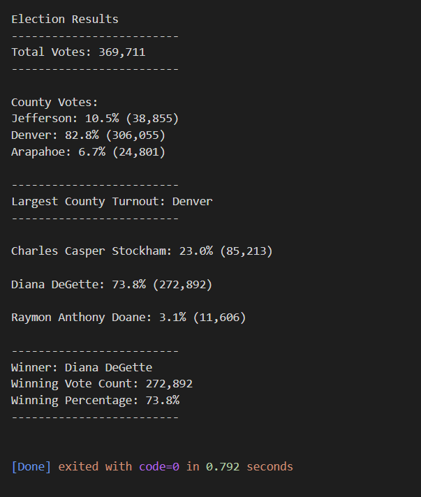

# Election_Analysis
## Colin Leung

## Overview of Election Audit
In this project, I summarized the results of an election. There are three candidates and each voter is allowed to select just one. Each voter ID is linked with the voter they chose. Using python to download and analyze the dataset, I computed the voter turnout for each county, the percentage of votes from each county out of the toal count, and the county with the highest voter turnout. 

## Election-Audit Results

### How many votes were cast in this congressional election?
Total of 369,711 votes

### Provide a breakdown of the number of votes and the percentage of total votes for each county in the precinct.
The majority of votes came from the Denver county with 82.8 percent of total votes. Jefferson and Arapahoe had 10.5 and 6.7 percent of votes in their counties. 

### Which county had the largest number of votes?
The largest county turnout of the three counties was Denver

### Provide a breakdown of the number of votes and the percentage of the total votes each candidate received.
The majority of votes went to Diana DeGette followed by Charles Casper Stockham and then lastly Raymon Anthony Doane. Degette summed to 272,892 of the total 369,711 votes which was 73.8 percent. Stockham received 23 percent and Doane received the remaining 3.1 percent of the votes.

### Which candidate won the election, what was their vote count, and what was their percentage of the total votes?
Diana DeGette won the election with 272,892 votes and 73.8% of the total votes.

## Election-Audit Summary
This script can be used for any election since it scans for unique candidates. Thus the script is not limited to any amount of candidates nor type of candidate. One modification that can be made is the removal of the county proportion of the code. Not every data set of election data will include county which would cause an error in the script. However, every data set should have the candidate name included, if not a symbol representing that candidate, which is unique and can be counted by the code. Another modification is the event of a tie winner. The winner portion of the code only refers to the candidate that has the most amount of votes but there is no statement which is used for an election where multiple candidates have the same, majority amount of votes
